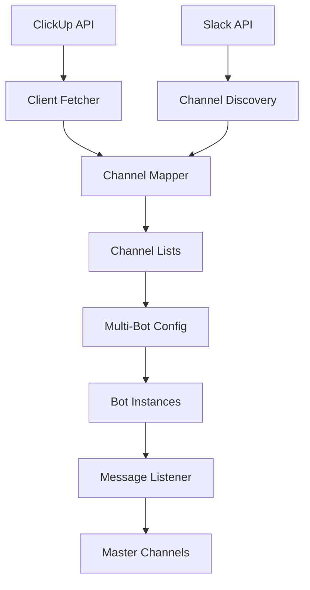

# Project Structure

## Directory Layout

```
master-listener/
├── 📁 src/                     # Source code
│   ├── 📁 core/               # Core bot functionality
│   │   ├── listener.py        # Main message listener and forwarder
│   │   └── multi_bot_launcher.py  # Multi-bot orchestration system
│   ├── 📁 config/             # Configuration and discovery
│   │   ├── multi_bot_config.py    # Bot configuration management
│   │   ├── channel_discovery.py   # Automatic channel discovery
│   │   └── channel_mapper.py      # ClickUp-Slack channel mapping
│   └── 📁 utils/              # Utility modules
│       ├── clickup_client_fetcher.py  # ClickUp API integration
│       └── slack_channel_fetcher.py   # Slack API utilities
├── 📁 scripts/                # Deployment and utility scripts
│   ├── bot_channel_inviter.py     # Bot invitation utilities
│   ├── setup_3_bots.py           # 3-bot setup script
│   ├── start_3_bots.py           # 3-bot launcher
│   ├── test_3_bots.py            # Multi-bot testing
│   └── *.bat, *.ps1             # Windows batch scripts
├── 📁 data/                   # Runtime data files
│   ├── channel_assignment.json   # Bot-channel assignments
│   ├── channel_lists.json        # Channel categorizations
│   ├── client_lists.json         # ClickUp client data
│   ├── final_client_mapping.json # Detailed mapping results
│   └── discovered_channels.json  # Channel discovery cache
├── 📁 docs/                   # Documentation
│   ├── SETUP.md              # Setup and installation guide
│   └── PROJECT_STRUCTURE.md  # This file
├── 📁 logs/                   # Log files (created at runtime)
├── 📁 tests/                  # Test files
├── 📄 main.py                 # Main entry point
├── 📄 requirements.txt        # Python dependencies
├── 📄 Dockerfile             # Container configuration
├── 📄 docker-compose.yml     # Multi-container setup
├── 📄 README.md              # Project documentation
└── 📄 .gitignore             # Git ignore rules
```

## Core Components

### 🎯 Main Entry Point
- **`main.py`**: Primary entry point that initializes the multi-bot system

### 🤖 Core Bot Logic (`src/core/`)
- **`listener.py`**: Main message listener that handles Slack events and forwards messages
- **`multi_bot_launcher.py`**: Orchestrates multiple bot instances with health monitoring

### ⚙️ Configuration (`src/config/`)
- **`multi_bot_config.py`**: Manages bot configurations and channel assignments
- **`channel_discovery.py`**: Automatically discovers Slack channels and assigns them to bots
- **`channel_mapper.py`**: Maps ClickUp clients to Slack channels using intelligent matching

### 🔧 Utilities (`src/utils/`)
- **`clickup_client_fetcher.py`**: Fetches client lists from ClickUp API
- **`slack_channel_fetcher.py`**: Slack API utilities and channel management

### 📜 Scripts (`scripts/`)
- **Setup Scripts**: `setup_3_bots.py`, `setup_5_bots.py` - Bot configuration helpers
- **Launch Scripts**: `start_3_bots.py`, `run_3_bots.py` - Multi-bot launchers
- **Test Scripts**: `test_3_bots.py`, `test_individual_bots.py` - Testing utilities
- **Utility Scripts**: `bot_channel_inviter.py` - Channel invitation management

### 📊 Data Files (`data/`)
- **`channel_assignment.json`**: Maps channels to specific bot instances
- **`channel_lists.json`**: Categorizes channels (managed, storm, ignored)
- **`client_lists.json`**: ClickUp client data cache
- **`final_client_mapping.json`**: Detailed mapping results with confidence scores
- **`discovered_channels.json`**: Channel discovery results cache

## Data Flow



## Key Features by Component

### Multi-Bot Architecture
- **Load Balancing**: Distributes channels across multiple bots using consistent hashing
- **Health Monitoring**: Automatic bot restart and health checks
- **Rate Limit Management**: Prevents API rate limit issues through distribution

### Channel Management
- **Auto-Discovery**: Finds all admin, agent, and apptbk channels automatically
- **Smart Categorization**: Separates managed vs storm clients based on ClickUp data
- **Dynamic Assignment**: Reassigns channels when bots are added/removed

### Message Forwarding
- **Thread Support**: Maintains thread relationships in forwarded messages
- **File Handling**: Forwards file attachments and images
- **Edit Support**: Updates forwarded messages when originals are edited
- **Multiple Channel Types**: Handles admin, agent, and apptbk channels differently

### Integration Features
- **ClickUp Sync**: Automatically syncs client lists every 12 hours
- **Intelligent Matching**: Uses fuzzy matching to map clients to channels
- **Confidence Scoring**: Provides confidence levels for automated mappings

## Configuration Files

### Environment Variables (`.env`)
- Bot tokens and app tokens for multiple bots
- Master channel IDs for different message types
- ClickUp API token for client integration

### Runtime Data Files
- **JSON Format**: All data files use JSON for easy inspection and modification
- **Atomic Updates**: Files are updated atomically to prevent corruption
- **Backup Strategy**: Previous versions can be restored if needed

## Deployment Options

### Local Development
```bash
python main.py
```

### Docker Container
```bash
docker-compose up -d
```

### Production Deployment
- Multi-container setup with docker-compose
- Volume mounts for persistent data
- Automatic restart policies
- Log aggregation support

## Monitoring and Logging

### Log Structure
- **Timestamp**: ISO format with timezone
- **Component**: Module/bot identification
- **Thread**: Multi-threading support
- **Level**: DEBUG, INFO, WARNING, ERROR
- **Message**: Structured logging with emojis for readability

### Health Checks
- Bot status monitoring every 60 seconds
- Channel assignment validation
- API connectivity checks
- Automatic recovery procedures

## Security Considerations

### Token Management
- Environment variable storage only
- No hardcoded credentials
- Token rotation support

### Access Control
- Bot permission validation
- Channel access verification
- File handling security

### Container Security
- Non-root user execution
- Minimal base image
- Security scanning integration
